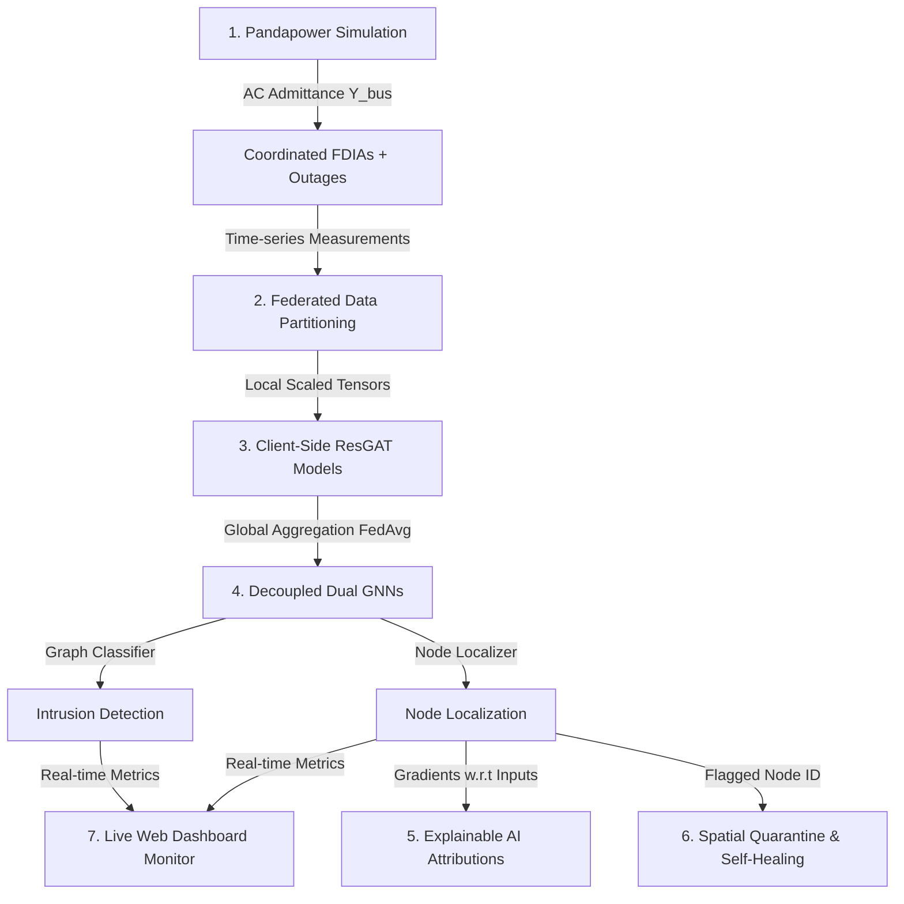

# Federated GAT-Twin: A Privacy-Preserving Cyber-Physical Digital Twin for Smart Grid Security

[](https://www.python.org/)
[](https://pytorch.org/)
[](https://opensource.org/licenses/MIT)

**Federated GAT-Twin** is an advanced, privacy-preserving cyber-physical Digital Twin framework designed to detect and localize **False Data Injection Attacks (FDIAs)** targeting synchrophasor PMU streams in power transmission networks. By combining **decoupled dual Graph Attention Networks (GATs)** with a **decentralized Federated Learning (FedAvg)** protocol, the framework identifies unphysical spatial deviations under dynamic grid reconfigurations (line/transformer outages) while maintaining operational privacy.

---

## 🚀 Key Features

*   **Decoupled Dual GATs**: Split into a graph-level anomaly detector (intrusion presence) and a node-level localizer (spotting compromised buses), preventing latency bottlenecks.
*   **Decentralized Federated Learning (FedAvg)**: Collaborative model training across utility operators without exchanging raw PMU measurement streams.
*   **Bandwidth-Efficient**: Extremely lightweight weight footprint (**~17.5 KB**) optimized for low-bandwidth SCADA network communication.
*   **Physics-Conforming AC-FDIA Modeling**: An adversary model that bypasses traditional residual-based Bad Data Detection (BDD) by conforming to admittance matrix ($Y_{bus}$) constraints.
*   **Explainable AI (XAI)**: Gradient-based feature attributions map prediction logits back to input features to verify physical consistency.
*   **Grid Self-Healing (Mitigation)**: Automated quarantining of compromised streams and spatial neighbor-state reconstitution to recover grid state estimation.
*   **Interactive Digital Twin Dashboard**: Real-time HTTP streaming web dashboard for online monitoring of PMU streams.

---

## 🗺️ System Flow



---

## 📁 Repository Structure

```text
Grid_Project/
├── data/                             # System topologies and processed datasets
│   ├── grid_topology_ornl.csv        # MSU/ORNL 4-relay static connection map
│   ├── grid_topology_39bus.csv       # IEEE 39-bus static connection map (lines + transformers)
│   ├── grid_topology_39bus_dynamic.csv # Snapshot-specific active edges for 39-bus
│   ├── grid_topology_118bus.csv      # IEEE 118-bus static connection map
│   └── grid_topology_118bus_dynamic.csv # Snapshot-specific active edges for 118-bus
├── models/                           # Saved global neural network weights
│   ├── trained_gat_ornl.pth          # MSU/ORNL GAT Localizer weights (~17.5 KB)
│   ├── trained_gat_39bus.pth         # IEEE 39-bus GAT Localizer weights (~17.5 KB)
│   ├── trained_gat_39bus_graph.pth   # IEEE 39-bus GAT Detector weights (~17.5 KB)
│   ├── trained_gat_118bus.pth        # IEEE 118-bus GAT Localizer weights (~17.6 KB)
│   └── trained_gat_118bus_graph.pth  # IEEE 118-bus GAT Detector weights (~17.6 KB)
├── plots/                            # Performance visualizations and graphs
│   ├── federated_gat_ornl_results.png # Training loss and F1 curves for MSU/ORNL
│   ├── federated_gat_39bus_results.png # Training loss and F1 curves for 39-bus
│   ├── federated_gat_118bus_results.png # Training loss and F1 curves for 118-bus
│   ├── gat_explanation_bus105.png    # Gradient-based feature attributions (XAI)
│   ├── closed_loop_mitigation_error.png # State estimation L2 error self-healing timeline
│   └── multibus_scaling_recall.png   # Intrusion recall vs. attack node count (K)
├── report/                           # LaTeX source manuscripts & reports
│   ├── Final_Report.tex              # Academically-formatted report LaTeX document
│   ├── Federated_GAT_Twin_IEEE_Restructured.tex # IEEE publication-format LaTeX document
│   └── comparative_analysis_report.md # Unified comparative metrics report
├── src/                              # Python source code
│   ├── prepare_ornl_data.py          # MSU/ORNL dataset preprocessor
│   ├── generate_39bus_dataset.py     # IEEE 39-bus power flow simulator & dataset generator
│   ├── generate_118bus_dataset.py    # IEEE 118-bus power flow simulator & dataset generator
│   ├── train_ornl_federated.py       # Federated GAT trainer for MSU/ORNL grid
│   ├── train_39bus_federated.py      # Federated GAT trainer for IEEE 39-bus grid
│   ├── train_118bus_federated.py     # Federated GAT trainer for IEEE 118-bus grid
│   ├── explain_gat_118bus.py         # GNN feature attribution saliency analyzer (XAI)
│   ├── closed_loop_mitigation.py     # State quarantine & spatial self-healing simulation
│   ├── test_multibus_scaling.py      # Multi-bus attack scaling bounds evaluator
│   ├── compare_grid_networks.py      # Unified performance evaluator & report compiler
│   ├── run_pipeline.py               # Master script running the entire workflow end-to-end
│   └── web_dashboard.py              # HTTP digital twin streaming web dashboard server
└── .gitignore                        # Standard git exclusions (excludes venv/ and large CSVs)
```

---

## 🧮 Theoretical Formulations

### 1. Coordinated AC-FDIA Threat Model
To bypass local residual BDD, an attacker injects voltage changes $\Delta V = [\Delta V_m, \Delta V_a]^T$ at a target bus, and manipulates neighboring current measurements using physical grid admittance sensitivities:
$$\Delta I = Y_{bus} \Delta V$$
where $Y_{bus}$ is the complex admittance matrix. GAT-Twin overcomes this by analyzing spatial multi-hop correlation anomalies across the entire grid graph.

### 2. GNN Feature Attributions (XAI)
To calculate feature attributions for a localized node prediction, we compute the absolute gradients of the localizer logit prediction $P(\text{Attack}_i)$ with respect to the input features:
$$\mathbf{S} = \left| \frac{\partial P(\text{Attack}_i)}{\partial \mathbf{x}} \right|$$

### 3. Spatial Reconstitution (Mitigation)
Upon localizing an anomalous bus, its raw measurements are quarantined, and the state variables (voltage magnitude $V_i$ and angle $\theta_i$) are reconstituted spatially from its active neighbors $\mathcal{N}_i$:
$$\hat{V}_i = \frac{1}{|\mathcal{N}_i|} \sum_{j \in \mathcal{N}_i} V_j$$

---

## 📊 Cross-System Performance & Scalability

Below are the performance and scalability metrics compiled by the comparative evaluator across three grid sizes on a standard CPU:

| Grid Network | Buses | Branches | Intrusion F1 | Localization F1 | Inference Latency | Model Size |
| :--- | :--- | :--- | :--- | :--- | :--- | :--- |
| **MSU/ORNL (3-Bus)** | 4 | 3 | 45.80% | 45.80% | 0.66 ms | 17.5 KB |
| **IEEE 39-Bus** | 39 | 46 | 100.00% | 98.36% | 0.34 ms | 17.5 KB |
| **IEEE 118-Bus** | 118 | 172 | 86.79% | 95.87% | 0.52 ms | 17.6 KB |

### Key Scalability Takeaways:
1.  **Sub-Cycle Compliance**: Inference executes under **0.7 ms** across all networks, operating far below the **112 ms** sub-cycle control stability margin.
2.  **SCADA Compatibility**: The model file footprint remains **~17.5 KB** across all scales, ensuring communication overhead remains minimal.

---

## 🛠️ Installation & Setup

1.  **Clone the Repository**:
    ```bash
    git clone https://github.com/AvijitBaidya22580/Federated-GAT-Twin.git
    cd Federated-GAT-Twin
    ```

2.  **Set Up Python Environment**:
    Create a virtual environment and install the required dependencies (such as PyTorch, PyTorch Geometric, Pandapower, and Scikit-Learn):
    ```bash
    python -m venv venv
    # On Windows:
    .\venv\Scripts\activate
    # Install dependencies
    pip install torch torchvision torchaudio --index-url https://download.pytorch.org/whl/cpu
    pip install torch_geometric pandas numpy matplotlib scikit-learn pandapower joblib
    ```

---

## 💻 Running the System

### 1. Run the Full End-to-End Pipeline
You can re-run data preprocessing, dataset generation, federated training for all three networks, explainability attribution, self-healing, scaling bounds, and comparative report compiling in a single command:
```bash
python src/run_pipeline.py
```

### 2. Launch the Web Monitoring Dashboard
Run the Digital Twin stream simulator and open the web dashboard:
```bash
python src/web_dashboard.py
```
Open your browser and navigate to: **[http://localhost:8080](http://localhost:8080)**.
